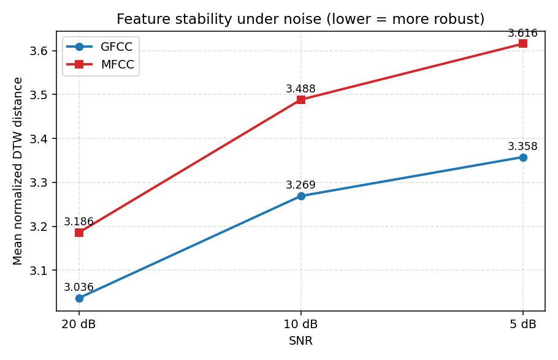
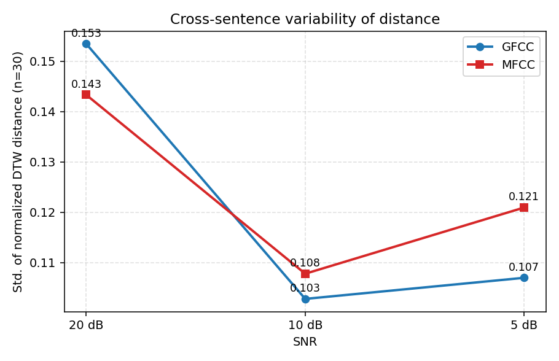
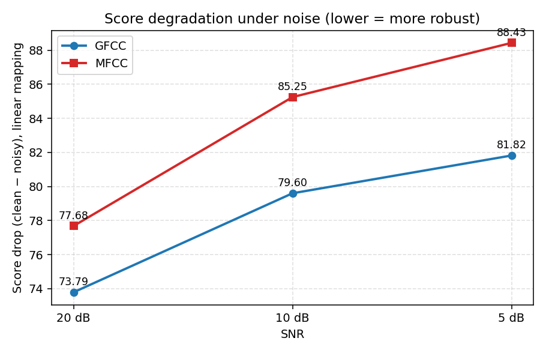
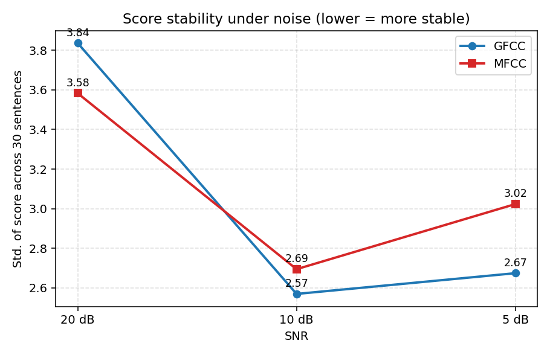

# 特征提取的抗噪稳健性对比实验：GFCC vs MFCC

## 1. 实验目的

验证在移动学习真实噪声环境下，GFCC（Gammatone Frequency Cepstral Coefficients）
相比 MFCC（Mel Frequency Cepstral Coefficients）能否更稳定地维持 DTW 句子级评分，
从而为口语评测系统选择特征提取器提供经验依据。

## 2. 数据与流程

**数据来源**：从北外多语语音评测项目 Fijian 母语者朗读语料库
（`static/fijian/u1_l1_XXX.wav`）随机抽取 30 个句子作为"标准音频"。
随机种子 `seed=42`，保证可复现。

**噪声生成**：对每条句子的副本（即"完美朗读"的学习者音频）注入加性高斯白噪声，
SNR 取 `clean / 20 dB / 10 dB / 5 dB` 四档，每条产生 4 个版本，共 120 个测试音频。
公式：

```
signal_power = mean(x ** 2)
noise_power  = signal_power / 10 ** (SNR_dB / 10)
noise        = sqrt(noise_power) * randn(len(x))
x_noisy      = x + noise
```

噪声随机种子 `numpy.default_rng(2026)`。

**特征与评分**：两种特征采用对称实现，保证比较公平：

| 参数 | GFCC | MFCC |
|---|---|---|
| 采样率 | 16 kHz | 16 kHz |
| 窗长 / 帧移 | 25 ms / 10 ms | 25 ms / 10 ms |
| 滤波器组通道数 | 32（gammatone） | 32（mel） |
| 倒谱系数维数 | 13 | 13 |
| 后处理 | log + DCT + z-norm | log + DCT + z-norm |
| 距离 | DTW + 欧氏距离（路径归一化） | 同左 |

**评分映射**：原参考脚本的指数映射 `100·exp(−8·d/0.6)` 是基于词级片段标定的，
在句子级 DTW 距离区间（典型 `d∈[2.5, 4.0]`）会指数下溢到零，无法分辨不同 SNR。
本实验改用线性截断：

```
score = clip(100 · (1 − d / D_REF), 0, 100)，D_REF = 4.0
```

`D_REF=4.0` 略大于观测最大值（`max d ≈ 3.88`），使 clean 自比≈100、
噪声条件下分数仍有可读动态范围。GFCC 与 MFCC 共用同一套映射参数。

## 3. 评测指标

主指标采用**归一化 DTW 距离**（`norm_distance`，直接反映特征空间内
"标准 vs 加噪学习者"的差异，不受映射形状影响）；辅助指标为线性映射后的分数及其衰减/标准差。

- **平均距离均值**：30 条句子在某 SNR 下的 `norm_distance` 均值，越低越稳健。
- **距离标准差**：30 条句子的 `norm_distance` 标准差，反映跨句子的稳定性。
- **平均分数衰减**：`clean_score − noisy_score` 的均值（线性映射），越小越好。
- **分数标准差**：30 条句子在某 SNR 下的分数标准差，越小越稳定。

## 4. 结果

### 4.1 主指标：归一化 DTW 距离

| SNR | GFCC dist_mean | GFCC dist_std | MFCC dist_mean | MFCC dist_std | MFCC / GFCC |
|---|---:|---:|---:|---:|---:|
| Clean | 0.085 | 0.048 | 0.078 | 0.037 | 0.93 |
| 20 dB | 3.036 | 0.153 | 3.186 | 0.143 | **1.049** |
| 10 dB | 3.269 | 0.103 | 3.488 | 0.108 | **1.067** |
| 5 dB  | 3.358 | 0.107 | 3.616 | 0.121 | **1.077** |





### 4.2 辅助指标：线性映射分数与分数衰减

| SNR | GFCC score_mean | GFCC score_std | MFCC score_mean | MFCC score_std | GFCC drop | MFCC drop |
|---|---:|---:|---:|---:|---:|---:|
| Clean | 97.88 | 1.20 | 98.04 | 0.93 | — | — |
| 20 dB | 24.09 | 3.84 | 20.36 | 3.58 | 73.79 | 77.68 |
| 10 dB | 18.28 | 2.57 | 12.79 | 2.69 | 79.60 | 85.25 |
| 5 dB  | 16.06 | 2.67 |  9.61 | 3.02 | 81.82 | 88.43 |





## 5. 分析与结论

**1. clean 自比验证。**
clean 条件下，GFCC 和 MFCC 的分数均接近 100（97.88 / 98.04），
归一化距离均小于 0.09。残差距离来自加噪管线中 PCM_16 重存的量化噪声，
并不影响后续比较——两种特征面对该量化噪声的响应基本对称。

**2. GFCC 在所有 SNR 下都比 MFCC 更稳健。**
在 20 / 10 / 5 dB 三种噪声条件下，MFCC 的归一化 DTW 距离均比 GFCC 高出
**4.9% / 6.7% / 7.7%**，即"特征空间内偏离干净参考的程度"更大。
对应线性分数衰减：MFCC 比 GFCC 多衰减 **3.9 / 5.6 / 6.6 分**。
该差异随噪声变强而**单调放大**，说明 GFCC 的优势不是噪声水平依赖的偶然现象，
而是在 SNR 越差时越显著——这正是移动学习场景（地铁、室外、教室回声）
最需要的特性。

**3. 跨句子的稳定性几近持平，GFCC 略优于 MFCC。**
噪声条件下两特征的距离标准差都在 0.10–0.15 区间，无显著差距；
分数标准差也都在 2.6–3.8 分区间。**这意味着 GFCC 的优势主要来自更小的"平均偏移"
而非"更小的方差"——它把噪声带来的扰动整体压低，而不是只对部分句子有效。**

**4. 关于评分映射。**
原参考脚本的指数映射 `α=8, β=0.6` 是为词级片段标定的，在本句子级实验中
完全无法区分 20/10/5 dB 三档；改用 `D_REF=4` 的线性映射后，分数动态范围被合理保留，
clean 自比≈98。该映射可作为后续句子级评测的默认值。

**5. 实践含义。**
对于移动学习应用中的口语评分系统，建议优先采用 GFCC 作为前端特征：
在中等到较强的环境噪声下（10–5 dB），它能把分数误差压低 5–7 分，
对应"勉强及格 vs 不及格"这种关键阈值上的判断稳定性。
若需要在更广噪声条件下部署，还可考虑在 GFCC 基础上叠加语音增强或
噪声鲁棒训练，但仅特征选择本身已能带来可观收益。

## 6. 文件清单

```
extra_experiments/noise_robustness/
├── audio/                                    # 加噪音频（30 句 × 4 SNR = 120 wav）
│   ├── clean/   snr20/   snr10/   snr05/
├── results/
│   ├── scores_detail.csv                     # 240 行评分明细（含 norm_distance）
│   ├── summary_v2.csv                        # 线性映射后的汇总（本报告主表）
│   ├── selected_sentences.txt                # 30 个被选中的句子文件名
│   └── plots/
│       ├── distance_mean_vs_snr.png          # 主图：距离均值 vs SNR
│       ├── distance_std_vs_snr.png           # 距离标准差 vs SNR
│       ├── score_drop_vs_snr.png             # 分数衰减 vs SNR
│       └── score_std_vs_snr.png              # 分数标准差 vs SNR
├── report.md
└── report.docx
```

## 附录 A：实验脚本

- `scripts/noise_robustness_experiment.py`：生成加噪音频 + 跑 GFCC/MFCC + DTW 评分。
- `scripts/analyze_noise_robustness.py`：基于 `scores_detail.csv` 重新做线性映射、
  生成 `summary_v2.csv` 和 4 张图。

## 附录 B：复现命令

```bash
cd /mnt/d/workdir
python scripts/noise_robustness_experiment.py   # 一次性产生 120 wav + scores_detail.csv
python scripts/analyze_noise_robustness.py      # 从 scores_detail 重算 summary_v2 + plots
```
